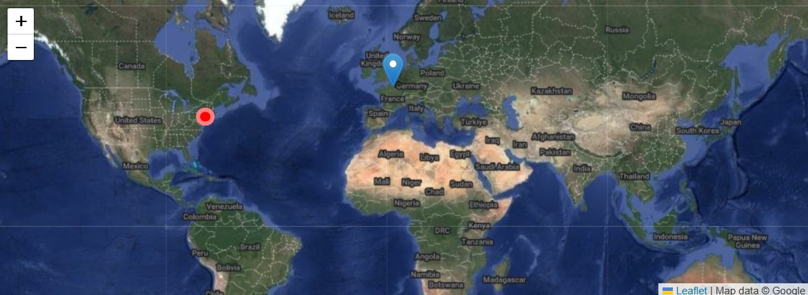

<div align="center" style="background-color: black; padding: 16px;">
  <a href="https://leafletjs.com" target="_blank"></a>
  &nbsp;&nbsp;&nbsp;&nbsp;&nbsp;
  <a href="https://astro.build/" target="_blank"></a>

  <h1>Astro Leaflet</h1>

  <p>
    Astro Leaflet is the native Astro component for
    <a href="https://www.leafletjs.com">leaflet</a>.
    leaflet is used to display maps, such as
    google maps or openstreetmap, along with markers,
    lines,...
  </p>

  [Demo](https://pascal-brand38.github.io/astro-dev/packages/astro-leaflet)

  <a href="https://pascal-brand38.github.io/astro-dev/packages/astro-leaflet" target="_blank">
    
  </a>

</div>

<br>
<br>

___________________________________

# Installation
Get the latest version from NPM:
```
$ npm install astro-leaflet
```

Once installed, please add the following in ```astro.config.mjs``` file as detailed
in the [troubleshooting section](#troubleshooting):
```js
export default defineConfig({
  ...
  vite: {
    optimizeDeps: {
      include: ['astro-leaflet > leaflet'],
    }
  },
  ...
});
```

<br>

___________________________________

# Want to help?

Please [open an issue](https://github.com/pascal-brand38/astro-leaflet/issues)
to ask for:
* bug fix
* add a new feature, part of leaflet,
  but not implemented in astro-leaflet yet
* having your favorite tile url be part of a
  [friendly name](#tileByName).
  This helps everyone quickly chosing the right map.

Contributions and [Pull Request](https://github.com/pascal-brand38/astro-leaflet/pulls) are welcome.

<br>

___________________________________

# Usage

Here is a minimal example that is using openstreetmap

```jsx
---
import { Leaflet } from "astro-leaflet";
---
<Leaflet />
```

In case no map is displayed, or in case of any problem,
please refer to the [Troubleshooting section](#Troubleshooting)

<br>

___________________________________


## Tutorials

[astro-dev](https://pascal-brand38.github.io/astro-dev/packages/astro-leaflet/)
provides different ways of using ```astro-leaflet```

[Leaflet tutorials](https://leafletjs.com/examples.html) is a great way to learn Leaflet.
Here is a list of the leaflet tutorials implemented
with ```astro-leaflet```.

* [Layer Groups and Layers Control](https://pascal-brand38.github.io/astro-dev/packages/astro-leaflet/#LayerGroupsAndControl):
  A tutorial on how to manage groups of layers and use the layer switching control.
  It demontrates how to use ```astro-leaflet``` components
  \<ControlLayer>, \<LayerGroup>, \<BaseLayer> and \<Overlay>

<br>

___________________________________

# Components:

## \<LeafLet>

Main component to create a leaflet map.
Check following examples (code is provided):
* [Minimal usage of ```<Leaflet>```](https://pascal-brand38.github.io/astro-dev/packages/astro-leaflet/#minimal)
* [Google Earth and markers](https://pascal-brand38.github.io/astro-dev/packages/astro-leaflet/#google-map-markers)


Usage:
```
<Leaflet options={{...}}>
</leaflet>
```

with the following option properties:
* ```tileByName```: friendly name of the layer to display.
  Check [astro-dev](https://pascal-brand38.github.io/astro-dev/packages/astro-leaflet/#SelectLayer)
  for an interactive description and display of implemented human friendly name.
  Section [tileByName](#tileByName) gives more details on this parameter,
  and its possible values
* tileLayer: if ```tileByName``` is not provided, this is the
  url of the main tile layer. Default is the one of openstreetmap when neither
  ```tileByName``` nor ```tileLayer``` is provided.
* ```tileLayerOptions```: [Leaflet options](https://leafletjs.com/reference.html#tilelayer-minzoom)
  to set the attribution,...
*  ```mapOptions```: [Leaflet options](https://leafletjs.com/reference.html#map-prefercanvas)
*  ```setViewOptions```: [Leaflet options](https://leafletjs.com/reference.html#zoom/pan-options)
* ```center```: array of latitude and longitude. Default is centered on south europe
* ```zoom```: a number for the zoom. Default is 2, that is a far view
* ```markers```: an array of ```AstroLeafletMarkerType```

<br>
Basic example to display google satellite images:

```
<Leaflet options={{ tileByName: 'Google' }} />
```


### <a name="tileByName"></a> tileByName

This parameter is used in ```<LeafLet>``` and ```<TileLayer>```.
This is a friendly name to infer url address of the layer, as well as
the associated options, such as subdomains,...

Please check
[astro-dev](https://pascal-brand38.github.io/astro-dev/packages/astro-leaflet/#SelectLayer)
to list friendly names, and preview the result in Leaflet.

Here is a non-exhaustive list:
* ```OSM```
* ```Google```: default is satellite
  * ```Google&type=satellite```
  * ```Google&type=street```
  * ```Google&type=hybrid```
  * ```Google&type=terrain```
  * ```Google&type=hybrid&extra=transit,bike```
  * The language can also be provided adding ```&lang=xx```,
  such as for example ```Google&type=street&lang=en```
* Michelin: default is map
  * ```Michelin&map```
  * ```Michelin&label```

<br>

___________________________________

## \<TileLayer>

Component to add a layer on top of the main layer. This can
be usefull for example to display labels on top of satellite images.
Must be implemented in the ```<Leaflet>``` slot.

Usage:
```
<TileLayer
  urlTemplate='url of the tiles to overlay
  options={{ leaflet options of tileLayer() }}>
```

Full example can be found at:
* [NYC Marathon](https://pascal-brand38.github.io/astro-dev/packages/astro-leaflet/#NYC-Marathon)

<br>

___________________________________

## \<Polyline>

Components to draw polyline overlays on a map.
Must be implemented in the ```<Leaflet>``` slot.


Usage:
```
<Polyline
  latlngs={array of LatLngTuple[]}
  options={{  leaflet options of polyline() }}>
```

Full example can be found at:
* [NYC Marathon](https://pascal-brand38.github.io/astro-dev/packages/astro-leaflet/#NYC-Marathon)


<br>

___________________________________

## \<FitBounds>

Components to automatically center the map on elements
of the map, such as the points of a polyline.
Must be in the slot of the element to center to.

```
<FitBounds/>
```

Full example can be found at:
* [NYC Marathon](https://pascal-brand38.github.io/astro-dev/packages/astro-leaflet/#NYC-Marathon)


<br>

___________________________________

## \<ImageOverlay>

Components to load and display a single image over specific bounds of the map.

* imageUrl: URL of the image
* bounds: geographical bounds it is tied to
* options: optional [leaflet options](https://leafletjs.com/reference.html#imageoverlay-option)
  of the ImageOverlay: opacity,...

Example:

```
<ImageOverlay
  imageUrl="https://maps.lib.utexas.edu/maps/historical/newark_nj_1922.jpg"
  bounds={[[40.712216, -74.22655], [40.773941, -74.12544]]}
  options={{opacity:0.5}}
/>
```

Full example can be found at
[astro-dev#ImageOverlay](https://pascal-brand38.github.io/astro-dev/packages/astro-leaflet/#ImageOverlay)


<br>

___________________________________

## API

For each astro-leaflet components, there is a link
to the full demo and code:
* ```\<Circle>```:
  [Leaflet Quick Start Guide](https://pascal-brand38.github.io/astro-dev/packages/astro-leaflet#QuickStart)
* ```\<Marker>```:
  [Leaflet Quick Start Guide](https://pascal-brand38.github.io/astro-dev/packages/astro-leaflet#QuickStart),
  [Layer Groups and Layers Control](https://pascal-brand38.github.io/astro-dev/packages/astro-leaflet/#LayerGroupsAndControl)
* ```\<Polygon>```:
  [Leaflet Quick Start Guide](https://pascal-brand38.github.io/astro-dev/packages/astro-leaflet#QuickStart)
* ```\<GeoJson>```:
  [Interactive Choropleth Map](https://pascal-brand38.github.io/astro-dev/packages/astro-leaflet#Choropleth),

<br>

* ```\<ControlLayer>```:
  [Interactive Choropleth Map](https://pascal-brand38.github.io/astro-dev/packages/astro-leaflet#Choropleth),
* ```\<ControlLayer>```:
  [Layer Groups and Layers Control](https://pascal-brand38.github.io/astro-dev/packages/astro-leaflet/#LayerGroupsAndControl)
* ```\<LayerGroup>```:
  [Layer Groups and Layers Control](https://pascal-brand38.github.io/astro-dev/packages/astro-leaflet/#LayerGroupsAndControl)
* ```\<BaseLayer>```:
  [Layer Groups and Layers Control](https://pascal-brand38.github.io/astro-dev/packages/astro-leaflet/#LayerGroupsAndControl)
* ```\<Overlay>```:
  [Layer Groups and Layers Control](https://pascal-brand38.github.io/astro-dev/packages/astro-leaflet/#LayerGroupsAndControl)

<br>

* ```\<Popup>```:
  [Leaflet Quick Start Guide](https://pascal-brand38.github.io/astro-dev/packages/astro-leaflet#QuickStart),
  [Layer Groups and Layers Control](https://pascal-brand38.github.io/astro-dev/packages/astro-leaflet/#LayerGroupsAndControl)

* ```\<FitBounds>```:
  [Layer Groups and Layers Control](https://pascal-brand38.github.io/astro-dev/packages/astro-leaflet/#LayerGroupsAndControl)
* ```\<FitWorld>```:
  [Leaflet on Mobile](https://pascal-brand38.github.io/astro-dev/packages/astro-leaflet#Mobile),

<br>

* Dealing with events:
  * [Leaflet Quick Start Guide](https://pascal-brand38.github.io/astro-dev/packages/astro-leaflet#QuickStart),
  * [Leaflet on Mobile](https://pascal-brand38.github.io/astro-dev/packages/astro-leaflet#Mobile),
  * [Interactive Choropleth Map](https://pascal-brand38.github.io/astro-dev/packages/astro-leaflet#Choropleth),


___________________________________

## \<CreateLeafletIcon>

Create a custom icon to be displayed in markers.
Must be implemented before the ```<Leaflet>``` slot.

Note that only divicons are supported for the time-being.

Usage:
```
<CreateLeafletIcon
  name='name of the icon to be used in markers'
  options={{
    className:"leaflet-icon-myicon",
    iconSize: [20,20]
    ...
  }}/>
<Leaflet options={options}/>

<style is:global>
	/* class definition used to define the custom icon */
	.leaflet-icon-myicon {
		background:red;
		border:5px solid rgba(255,255,255,0.5);
		border-radius:50%;
	}
</style>
```

Full example can be found at:
* [Google Earth and markers](https://pascal-brand38.github.io/astro-dev/packages/astro-leaflet/#google-map-markers)


<br>

___________________________________

# Complex Examples

Please check the [online doc](https://pascal-brand38.github.io/astro-dev/packages/astro-leaflet) for a fullset of examples.

Full code is provided.

<br>

___________________________________

# License
Astro-leaflet is released under the MIT license.

Astro-leaflet is using [leaflet](https://github.com/Leaflet/Leaflet).
leaflet is a BSD-2-Clause license software

<br>

___________________________________

# <a name="Troubleshooting"></a> Troubleshooting

## Map not displayed

If the map is not displayed, and you have the following error in the console

```
Uncaught SyntaxError: The requested module '/node_modules/leaflet/dist/leaflet-src.js?v=c7414b9d' does not provide an export named 'layerGroup' (at layergroup.ts?v=c7414b9d:1:10)
```

or

```
SyntaxError: Importing binding name 'default' cannot be resolved by star

```

then you have to add the following inside ```astro.config.mjs```:

```js
export default defineConfig({
  ...
  vite: {
    optimizeDeps: {
      include: ['astro-leaflet > leaflet'],
    }
  },
  ...
});
```

According to [vite](https://vite.dev/config/dep-optimization-options.html#optimizedeps-exclude)
> CommonJS dependencies should not be excluded from optimization. If an ESM dependency is
> excluded from optimization, but has a nested CommonJS dependency, the CommonJS dependency
> should be added to optimizeDeps.include.

Leaflet 2.x will be ESM. It is still in alpha release at the time of writing, so
astro-leaflet is using 1.9 version which is CommonJS.